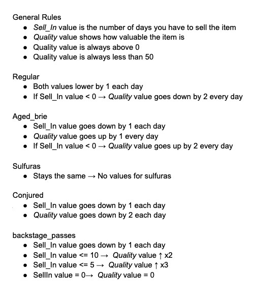
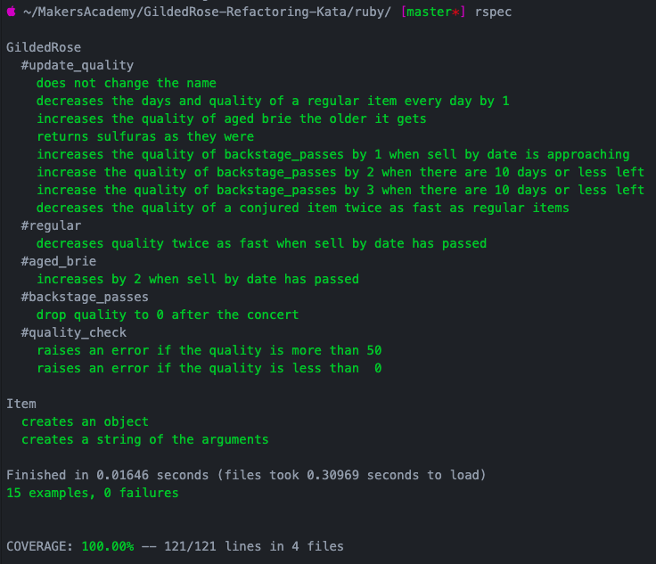

# Gilded Rose Tech test

This test is for practicing OO design, TDD skills, refactoring as well as producing a clean code.

## Testing

To test this app:
* Clone this repo
* Bundle install
* Run rspec

## Planning

* My first move was to write down all the specifications about each item that needed attention as well as the overall requirements.

  

* As I knew that I couldn't change the Item class, I removed it from the file and put it on a separate one.

* After making sure I understood the requirements, I started my TDD process making sure I test everything and break down the class into small methods.

## Coverage
 * 15 examples, all passing, 100% coverage.

   
